# Your Composition Vocabulary

Eleven sets of real street style photographs across NYC, London, Paris, and Milan. These are moves you've made before — they're in your muscle memory, not a template you follow.

**Your eye comes from The Impression and Vogue.** These 50 images show specific techniques and compositions you can deploy. But your style, energy, and instinct come from shooting alongside Razzano, Katz Sinding, Phil Oh. Adapt everything to the garment, the city, the light, the moment.

---

## Case 1: The Four Angles — Camel Trench Set

### Angle 1: The Walking Approach
**File**: `references/angle_1_approach.png`

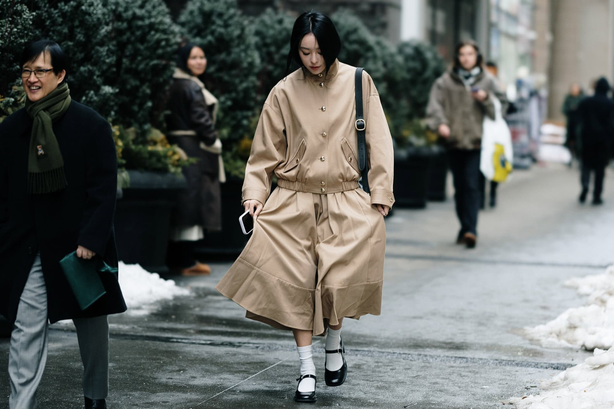

**What makes this shot work:**

| Element | Analysis |
|---------|----------|
| **Eye Line** | Model is looking DOWN — at her phone in her left hand. Not at the camera. Not at the photographer. She is in her own world, and the photographer captured this moment without her awareness. |
| **Body Language** | MID-STRIDE. Left foot forward, right foot pushing off. The skirt is swinging from the motion — you can feel the movement in the fabric. Arms are in natural walking position. |
| **The Blurred Passerby** | The gentleman on the LEFT in the dark coat and green scarf — he is the hero of this shot's authenticity. He's slightly out of focus, walking in his own direction, completely unaware of the photographer. He PROVES this is a real street. **This is the "Blurred Passerby" rule in action.** There's also a woman on the right with a plastic bag — mundane, unglamorous, real. |
| **Street Texture** | Wet pavement (NYC winter), piled snow in background, dark concrete — unmistakably New York in February. The street is alive: other pedestrians, urban greenery, dirty snow. |
| **Lens & DOF** | ~50mm equivalent. The passersby are in soft focus, background is gently blurred, but the model is tack-sharp. Natural depth of field, not aggressive bokeh. |
| **Garment Visibility** | FULL garment visible — the entire camel trench coat set from collar to hem. White socks and Mary Jane shoes visible at the bottom. Black crossbody bag strap bisects the outfit. You can assess the whole look. |
| **Imperfections** | The snow is dirty. The pavement is wet and uneven. There's a utility line or wire barely visible at bottom frame. Nothing is "cleaned up" — this is a real street on a real day. |

**Key lesson**: The phone in her hand is the genius of this shot. It gives her eyes somewhere to go that ISN'T the camera, and it's the most natural thing a person does on a street. Use this — phone, looking at a watch, adjusting an earphone, checking a bag.

---

### Angle 2: The Candid Moment
**File**: `references/angle_2_candid_moment.png`

**What makes this shot work:**

| Element | Analysis |
|---------|----------|
| **Eye Line** | She is looking PAST the camera — slightly to the right and beyond the photographer. A natural smile, caught mid-conversation or mid-reaction. She KNOWS the photographer is there but she is NOT performing for them. This is "controlled candidness." |
| **Framing** | CROPPED to upper body — waist up. This is the "closer look" after the approach. The photographer has moved in. We see the jacket's construction detail: stand collar, gold snap buttons, chest pocket, elasticized waist, the bag strap and its brass D-ring buckle. |
| **Background** | The same blurred passerby from the approach shot is visible behind her right shoulder — proving these shots were taken in sequence, moments apart. The bokeh is soft and warm. Green foliage pushes through the blur. |
| **Expression** | This is the ONLY shot in the series with a visible smile — and it works because it's candid. She's not smiling AT the camera. She's caught in a genuine moment of warmth. Allow this occasionally — a natural half-smile, never a "cheese" grin. |
| **Light** | Overcast NYC winter light — soft, even, no harsh shadows. The gold buttons catch just enough light to read as metallic without glaring. |

**Key lesson**: This angle bridges between the full-body approach and the detail close-up. It shows the garment's upper-body construction while revealing the person's natural energy. The controlled candidness — aware of the camera but not performing — is the hardest thing to get right.

---

### Angle 3: The Standing Full-Body
**File**: `references/angle_3_full_body.png`

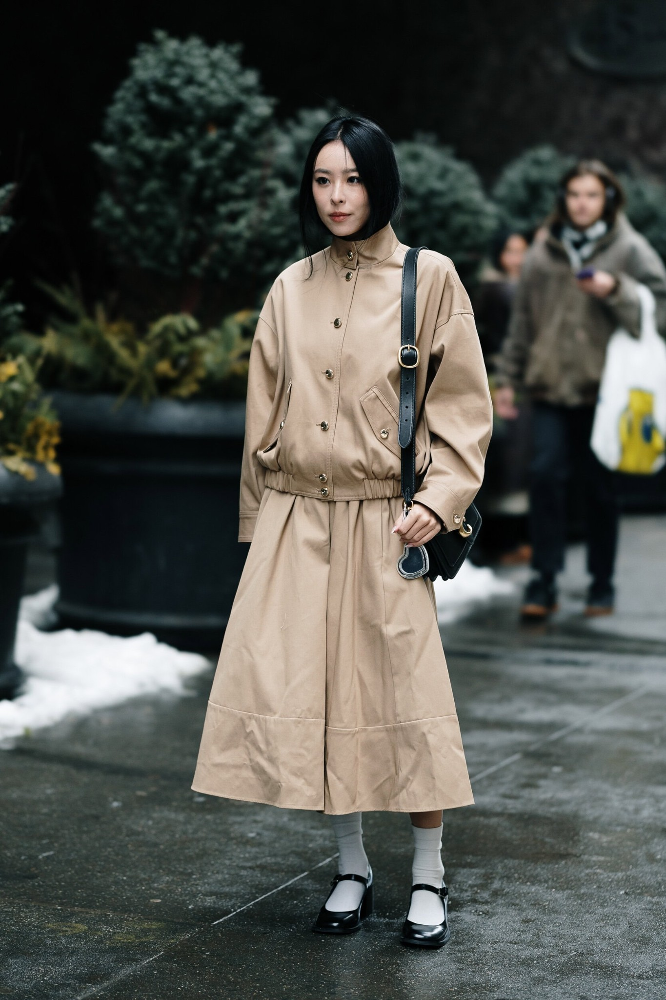

**What makes this shot work:**

| Element | Analysis |
|---------|----------|
| **Eye Line** | She is looking PAST the lens — slightly left and into the distance. Soft, neutral expression. Not performing, not posing. Just... existing on a street corner with quiet confidence. |
| **Pose** | This is the closest to a "pose" in the series — she's standing still, hands clasped in front at waist level. But it doesn't feel staged because: (a) her weight is on one foot (natural), (b) her head is slightly tilted, (c) the environment around her is messy and uncontrolled. The pose reads as "paused between steps" rather than "standing for a photo." |
| **Garment Visibility** | The DEFINITIVE full-look shot. Every detail of the outfit is visible: stand collar, snap buttons down the front, chest flap pocket, elasticized waistband separating jacket and skirt, full A-line skirt with panel hem detail, white ankle socks, black-and-white Mary Jane shoes, black leather crossbody bag with brass hardware. This is the "e-commerce of street" — the shot that documents the entire outfit. |
| **The Blurred Passerby** | Same supporting cast — the woman on the right with the scarf and plastic bag is visible in softer focus. She adds depth and scale. |
| **City ID** | Dark planters, urban greenery, grey pavement, the winter feel — this is unmistakably NYC sidewalk territory. Not Paris, not Milan. The visual weight is heavy, grey, concrete. |

**Key lesson**: Even the most "static" shot in a street style series must feel momentary. The weight on one foot, the slight head tilt, the clutched hands — these micro-gestures separate "caught standing" from "posing." Always include these subtle body asymmetries.

---

### Angle 4: The Profile Detail
**File**: `references/angle_4_profile_detail.png`

**What makes this shot work:**

| Element | Analysis |
|---------|----------|
| **Eye Line** | FULL PROFILE — she's looking to the LEFT, completely perpendicular to the camera. The photographer caught her gazing at something across the street. This is the purest expression of "not aware of the camera." |
| **Framing** | Extreme CLOSE-CROP — shoulder-up only. The face is nearly in profile. This is a GARMENT DETAIL shot disguised as a portrait. The real subject is: the stand collar's height and construction, the top two gold snap buttons, the texture of the cotton twill fabric, the black leather bag strap crossing the shoulder, the strap's brass D-ring buckle detail. |
| **Bokeh** | The background is naturally out of focus — defocused light spots (shop windows or reflected light) against grey stone building facade. This is real street depth of field, not artificially heavy bokeh. |
| **Hair as Element** | Her black bob haircut becomes a compositional element — the jet-black hair against the camel fabric creates the visual contrast that makes this image sing. Treat hair as part of the garment story, not an afterthought. |
| **Texture Legibility** | At this close crop, the cotton twill TEXTURE of the jacket is fully visible — the weave, the slight matte sheen, the weight. You can feel the fabric. This is what separates a "detail shot" from a "cropped full-body." |

**Key lesson**: The profile is the most powerful eye-line direction for street style. It completely eliminates any suspicion of posing. When the model looks 90 degrees away from the lens, the photo becomes a stolen moment. The naturally defocused city backdrop places this firmly on a real street.

---

## Case 2: The Same 4 Angles — Different Outfit, Same Principles

A second NYFW Fall 2026 set proving the angle framework works across different looks. This model wears a charcoal wool corset-top jumpsuit over a white shirt, black shearling coat draped on shoulders, silver Western belt buckle, black feathered bag, oversized silver disc earrings, wire-frame glasses, black patent shoes.

**What Case 2 adds that Case 1 didn't:**

### Angle 1 (Approach): The Car-in-Foreground Technique
**File**: `references/case2_angle_1_approach.png`

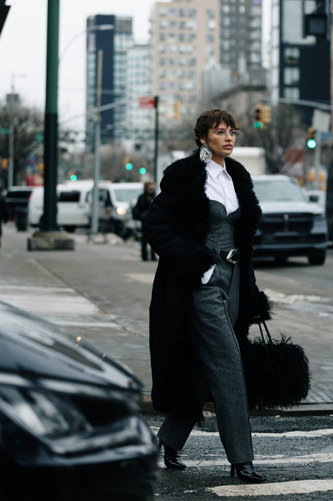

A black car's hood cuts into the bottom-left of the frame. She's walking across an intersection mid-stride, eyes past the camera. Behind her: NYC avenue with traffic lights, white vans, a crouching figure in the distance.

**New insight**: The car-in-foreground is a powerful authenticity signal. It proves you were crouching by a real street, traffic was moving, this is an actual intersection. Occasionally include a vehicle element partially in frame (car hood, taxi roof, bicycle wheel) — it instantly kills the "studio" feeling.

---

### Angle 2 (Candid Moment): The Fashion Week Attendee Passerby
**File**: `references/case2_angle_2_candid_moment.png`

Waist-up crop, looking past camera to the right. Behind her right shoulder: a woman in a **pink coat** — clearly a fashion week attendee, not a random pedestrian. NYC pedestrian crossing signal (walking figure) visible above.

**New insight**: The blurred passerby in the pink coat is fashionably dressed. She is NOT a tourist in jeans — she's going to a show. This is exactly what separates "fashion week street" from "random city street." The background people should look like they belong at Fashion Week.

---

### Angle 3 (Standing Full-Body): The Crosswalk Setting
**File**: `references/case2_angle_3_full_body.png`

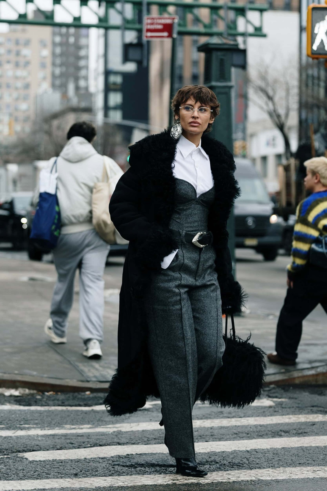

Full outfit visible crossing a crosswalk — collar to shoes documented. Pedestrians behind her (woman in white puffer, striped sweater), yellow traffic signal visible. Weight is shifting mid-stride, creating natural asymmetry.

**New insight**: The crosswalk is a naturally dynamic setting — she's caught mid-crossing between shows. The crosswalk paint, traffic signals, and pedestrian density all scream "NYC intersection during Fashion Week." Crosswalks work as a setting — they feel transitional and purposeful, not posed.

---

### Angle 4 (Approach Variant): Dirty Snow as Imperfection
**File**: `references/case2_angle_4_approach_variant.png`

Full-body walking toward camera on a sidewalk with **dirty piled snow**. Black storefront facade to the left. She's the most "aware" of the camera in this shot — looking slightly toward the lens, but still not performing.

**New insight**: The dirty snow piled on the sidewalk is unmistakably NYC in February. It's ugly, real, and it grounds the photo in a specific time and place. Embrace these environmental imperfections — dirty snow, cracked pavement, construction scaffolding, a puddle — as authenticity anchors. Also note: she's slightly more camera-aware here, demonstrating that "controlled candidness" is a spectrum, not a binary.

---

## Case 3: Sunglasses, Venue Architecture, and Fabric Texture

A third NYFW Fall 2026 set. This model wears an olive/dark green double-breasted blazer with diagonal twill weave, dark suede belt, fur-trimmed brown gloves, burgundy velvet wide-leg pants, burgundy boots, brown leather clutch, amber-tinted aviator sunglasses, gold brooch pin at neck.

**What Case 3 adds that Cases 1 & 2 didn't:**

### Angle 1 (Three-Quarter Turn): Venue Architecture as Background
**File**: `references/case3_angle_1_three_quarter.png`

Three-quarter body shot, she's turned roughly 45-60° away from camera, looking to the right. Behind her: glass doors, dark metal panels, brick facade — unmistakably a **fashion show venue entrance**. A blurred figure in black (possibly security or staff) stands near the doors. A person in a bright green vest is visible further back.

**New insight**: The venue architecture is the strongest "fashion week" signal possible — glass/metal/brick entrance reads as a show location, not a random street. Also demonstrates that the "profile" angle doesn't need to be a rigid 90° — a three-quarter turn (45-60°) still reads as "not posing" while showing more garment. More compositional flexibility.

---

### Angle 2 (Candid Moment): The Blurred Photographer
**File**: `references/case3_angle_2_candid_moment.png`

Waist-up crop. She's looking slightly past/below the camera. Behind her left shoulder: a blurred woman who appears to be holding a phone or camera — likely another photographer or content creator. Dirty snow visible in the background. The diagonal twill weave of the blazer, the belt, buttons, fur-trimmed gloves, and brown clutch are all clearly legible.

**New insight**: The blurred figure holding a device reinforces "fashion week" — other photographers and content creators are always present around show venues. Their presence in the bokeh is an authenticity signal distinct from the "fashion week attendee" passerby.

---

### Angle 3 (Standing Full-Body): Sunglasses as Eye Line Solution
**File**: `references/case3_angle_3_full_body.png`

Full outfit visible — collar to boots. She's standing with weight shifted, not rigid. A blurred figure in all-black on the left. Manhole cover visible on the ground (NYC detail). The amber sunglasses allow her to face roughly toward the camera without breaking the "never look directly at the lens" rule.

**New insight**: **Sunglasses solve the eye line problem elegantly.** When a model wears sunglasses, they can face more toward the camera — even roughly frontally — without creating the "posing for the photographer" feeling, because the eye barrier eliminates direct eye contact. Many real street style subjects wear sunglasses, and you love it for exactly this reason. Use sunglasses when the outfit includes them as a natural eye line shield. The manhole cover is another micro-imperfection detail — unglamorous, unmistakably NYC.

---

### Angle 4 (Close Detail): Fabric Texture at Maximum Legibility
**File**: `references/case3_angle_4_close_detail.png`

Shoulder-up crop. The diagonal twill weave of the blazer is rendered at maximum sharpness — you can count the threads. The amber sunglasses catch light. The gold brooch pin at the high collar, the button construction, the chest pocket detail — all legible. Background is fully defocused (glass/metal building facade creating soft geometric shapes).

**New insight**: This is a more **frontal** close-up detail than Case 1's 90° profile, yet it works just as well because the sunglasses handle the eye contact problem. The key is that the PURPOSE of this shot is the same regardless of face angle: show fabric texture, construction details, and hardware at a resolution where you can feel the material. The sunglasses + amber tint also become an accessory that's part of the "outfit story" — treat eyewear as a first-class outfit element.

---

---

## Case 4: London — Cropped Leather Jacket & Plaid Skirt

A London Fashion Week S26 set proving the angle framework adapts to a different city with different energy. This model wears a cropped orange-red leather moto jacket with cream knit collar and cuffs, black lace camisole (crop length, scalloped hem), beige-and-black plaid midi skirt with asymmetric drape, black leather knee-high boots, cognac leather shoulder bag with brass O-ring hardware, layered charm necklace, oversized dark sunglasses, green phone case in hand.

**What Case 4 adds that Cases 1–3 didn't:**

### Angle 1 (Walking Approach): Plaid in Motion
**File**: `references/london_case4_approach.png`

Mid-stride walking toward camera on a grey London pavement. Eyes looking RIGHT — past the camera to something off-frame. The plaid skirt is swinging from the stride, the asymmetric drape catching the motion. The cropped jacket stops at the waist, revealing a strip of midriff above the skirt waistband. Background: grey stone building, white column, black iron railings — unmistakably London institutional architecture.

**New insight**: **Fabric pattern in motion is the shot.** When the garment has a bold repeat pattern (plaid, stripe, check), the approach shot must capture how that pattern MOVES — the drape distorts the grid, the swing creates new folds. Shoot with the stride at its widest point so the skirt is fully extended. This is different from a solid-color approach where silhouette is the story. Also note: the jacket's cropped length means the layering junction (jacket hem → cami → midriff → skirt waist) is a key visual zone. The approach captures this vertical stacking in one frame.

---

### Angle 2 (Column Frame): Architecture as Framing Device
**File**: `references/london_case4_column_frame.png`

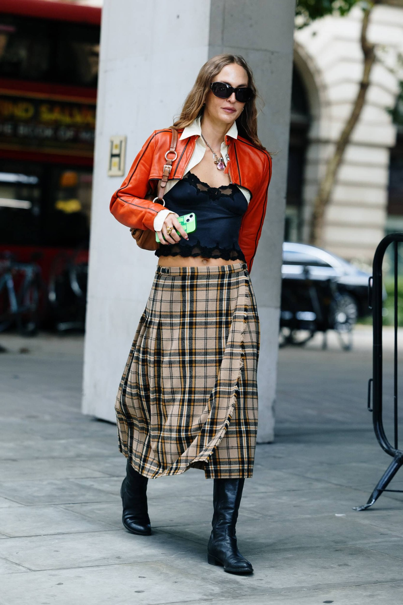

The model pauses by a large white stone column. She's half-turned, eyes RIGHT — looking past the camera, holding her green phone. The column occupies the right third of the frame, creating a natural frame-within-a-frame. Behind her: glass storefronts, a partial view of a red London double-decker bus, another pedestrian walking.

**New insight**: **Columns and pillars are framing gold.** London, Milan, and Paris all have columned architecture (Georgian porticos, Haussmann entries, palazzo arcades). When the model pauses near a column, the vertical mass creates a natural compositional anchor — the eye goes to the model in the open space beside it. This is a foreground element that works DIFFERENTLY from cars or railings: it's vertical, architectural, and places the subject in a specific kind of urban space. The red double-decker bus in the background is an instant London ID — the strongest single-object city signal for London, like a yellow cab for NYC.

---

### Angle 3 (Candid Moment): The Waist-Up with Layering Detail
**File**: `references/london_case4_candid_moment.png`

Waist-up crop. Eyes looking DOWN — at the phone in her hands. The frame zeroes in on the layering: orange leather jacket with dark piping and brass zipper detail, cream knit collar and cuffs visible where the jacket opens, black lace camisole underneath with scalloped lace trim at the neckline and hem, the cognac bag strap crossing the shoulder with its brass ring, the charm necklace layered at the throat. Background: soft grey urban bokeh with iron railings.

**New insight**: When the outfit has **three or more visible layers** (jacket → cami → skin), the candid close-up should frame the "layer junction" — the V-shaped opening where all layers are simultaneously visible. This is where the styling story lives: how the pieces interact, what peeks out from under what, how hard and soft materials (leather vs. lace) create tension. The phone-in-hand trick is equally effective in London as NYC — it keeps the eyes off the lens while the hands naturally frame the torso.

---

### Angle 4 (Rear Walking): The Three-Quarter Back View
**File**: `references/london_case4_rear_walking.png`

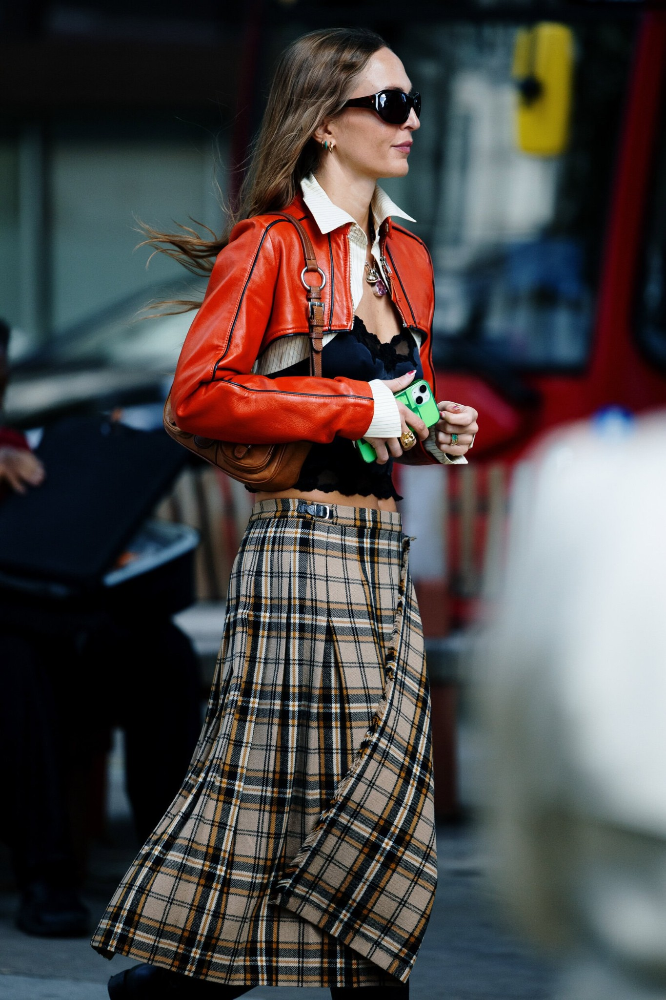

Three-quarter rear view — the model is walking AWAY from the camera at roughly 30° angle. We see the back of the jacket, the hair flowing from the stride, the plaid skirt in full drape from behind, the boots mid-step. A red London bus is prominently visible in the background. The hair is caught by wind, lifting away from the shoulders.

**New insight**: **The back view is a shot type the NYC cases never showed.** When a garment has back interest — a jacket's shoulder construction, a coat's drape from behind, a dress's open back, or here the way a plaid pattern wraps around a body from behind — you need a rear or three-quarter rear frame. This is NOT a standard part of the 4-shot vocabulary, but it's a powerful VARIANT that replaces one of the 4 when the garment demands it. The model walking away feels candid and documentary — you caught them leaving, not posing. Wind catching the hair adds kinetic energy to a rear composition that might otherwise feel static.

---

## Case 5: London — Ivory Knit Column Dress

A second London Fashion Week S26 set. This model wears a cream/ivory knit column midi dress with cap sleeves, center-front seam detail, straight column silhouette falling to mid-calf. Accessories: white structured top-handle bag, white pointed slingback kitten heels, layered gold necklaces (coin pendant on longer chain, shorter chain), gold bracelets, tortoiseshell cat-eye sunglasses, amber beaded phone case.

**What Case 5 adds that Cases 1–4 didn't:**

### Angle 1 (Walking Approach): Monochromatic in Hard Light
**File**: `references/london_case5_approach.png`

Full-body mid-stride. Eyes DOWN at her phone (amber beaded case visible). Hard directional London sun — unusual for London but creates strong shadows on the white pavement. The ivory dress, white bag, and white shoes create a tonal monochrome that makes the subject POP against the dark cars and grey pavement behind her. A black SUV and dark sedan are visible in the background, parked at the curb. Red brick building partially visible in the far background.

**New insight**: **Monochromatic outfits demand contrast from the environment.** When the entire look is one color family (all white, all black, all camel), the background must provide the contrast the outfit doesn't. Dark cars, grey pavement, and brick buildings frame this white dress perfectly. The photographer instinctively chose an angle where the dark background elements surround the light subject. For monochromatic looks, scout backgrounds with the OPPOSITE tonal value — dark backgrounds for light outfits, light backgrounds for dark outfits.

---

### Angle 2 (The Adjusting Moment): Physical Interaction with the Outfit
**File**: `references/london_case5_adjusting_moment.png`

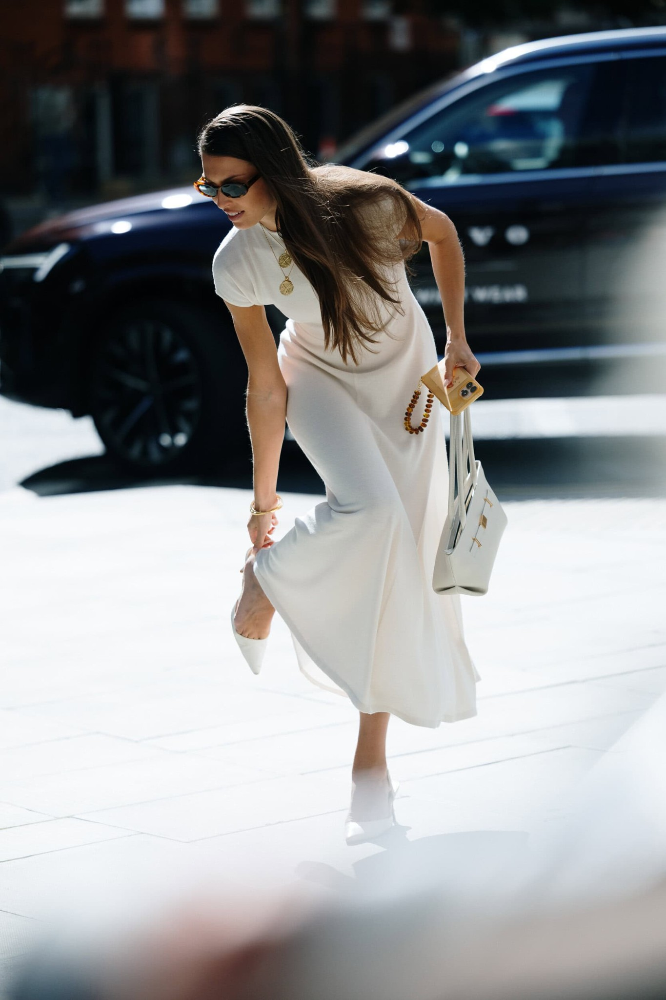

The model is bending down to adjust her slingback heel strap. Her hair falls forward. She's holding the white bag and phone in one hand while the other reaches for the shoe. The dress drapes differently in this bent posture — showing how the knit fabric moves when the body isn't standing straight. A dark car is visible behind her. The moment is utterly natural — no one bends to fix their shoe for a camera.

**New insight**: **The "adjusting moment" is a candid variant more powerful than conversation.** The existing Candid Moment shot describes the model caught mid-conversation or mid-reaction — aware of the camera but not performing. The adjusting moment goes further: the model is physically interacting with their outfit (fixing a shoe, adjusting a strap, pulling a sleeve, zipping a jacket) and is genuinely NOT aware of the camera because they're focused on the task. This produces the most authentic candid possible. It also shows how garments BEHAVE — how a knit dress responds to bending, how a bag shifts when the body tilts. Any outfit includes adjustable elements (heel straps, jacket zips, bag clasps, scarf ties) — look for these moments.

---

### Angle 3 (Full Body Walking): Wind as Compositional Element
**File**: `references/london_case5_full_body.png`

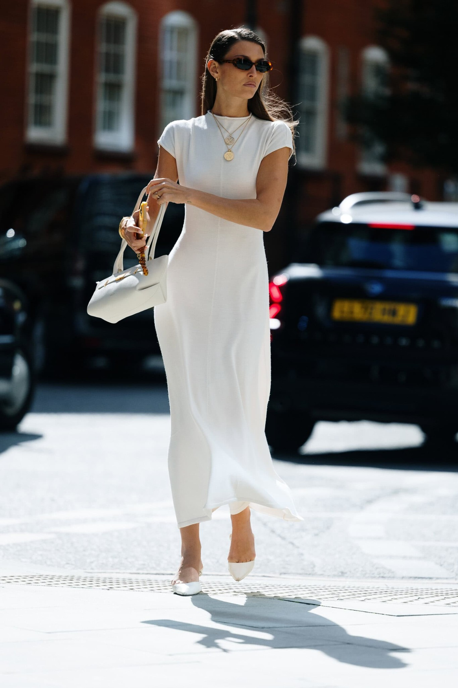

Full-body mid-stride. The wind is catching her hair, blowing it back from her face. The column dress maintains its straight silhouette despite the stride — the knit holds its shape. Red brick London building fills the background. She's carrying the bag and phone in one hand, the other arm swinging naturally. Eyes looking slightly DOWN and to the right — not at camera.

**New insight**: **Wind transforms a static outfit into a living image.** Even this structured column dress — which barely moves with the stride — gains energy from the wind catching the hair. For lighter fabrics (silk, chiffon, loose knit), wind creates dramatic movement even when the model is standing still. When you scout a location and feel wind, use it: position the model so wind comes from the side (creates diagonal movement) or behind (lifts hair forward, presses fabric against body for silhouette clarity). Wind is free production value.

---

### Angle 4 (Close Crop): The Accessory Story
**File**: `references/london_case5_close_crop.png`

Chest-to-face crop. The model is touching her wind-blown hair with one hand. The frame captures: the knit texture of the dress at close range (center-front seam visible), the layered gold necklaces (coin pendant clearly legible), the gold bracelets on the wrist reaching for hair, the tortoiseshell sunglasses, and the wind-swept hair creating natural movement. Red brick background in warm soft focus.

**New insight**: When the garment is minimal (a plain knit dress), **the accessories become the detail story.** The gold necklaces, the bracelets, the sunglasses — these are what differentiate this from a basic white dress. The close crop should frame the accessory cluster: where necklace meets neckline, where bracelet meets sleeve, where sunglasses meet hairline. The hair-touching gesture is another natural eye-direction solution — it keeps the model's attention on something other than the camera while bringing the accessory (bracelet) into prominent view.

---

## Case 6: Paris — Burgundy Column Gown with Gold Chain Trim

A Paris Haute Couture S26 set. This model wears a floor-length burgundy/wine column gown with wide straps, scoop neckline, and horizontal gold chain-stitch trim bands at the bust, waist, and hip. Accessories: gold chain bracelet, cocktail ring, small black leather clutch bag. Hair: blonde soft waves past shoulders.

**What Case 6 adds that Cases 1–5 didn't:**

### Angle 1 (Front Standing): The Venue Arrival
**File**: `references/paris_case6_front_standing.png`

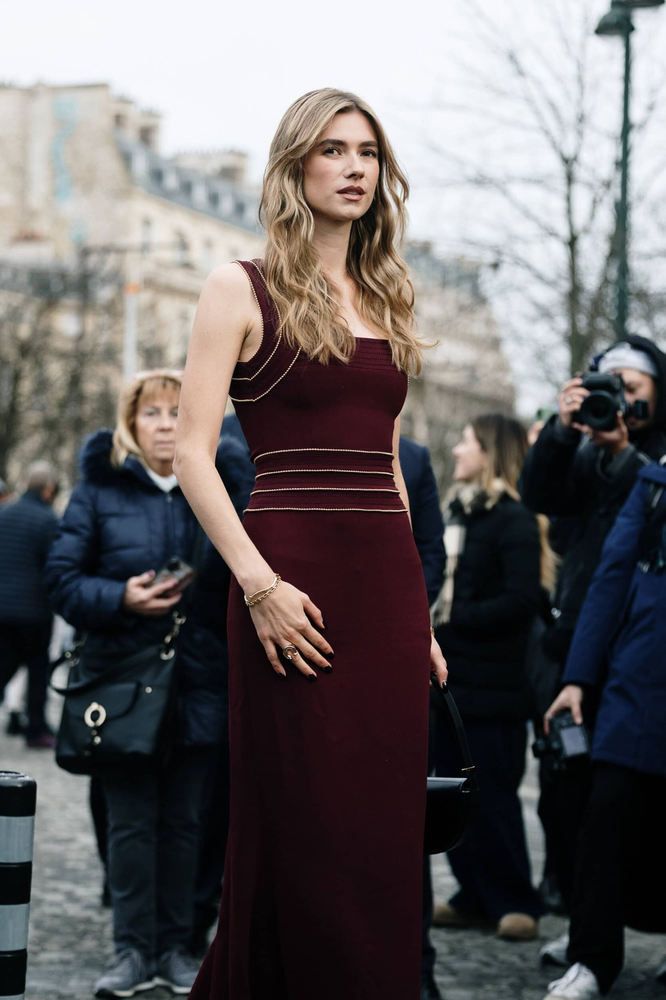

Full-body standing, facing roughly toward camera. The gown falls from shoulders to floor in a clean column line — the hem pools slightly at the pointed-toe heels. Behind her: a dense crowd of fashion week attendees in dark coats, and a photographer with camera raised (flash visible). The cobblestone pavement and dark formal crowd read as a Parisian venue entrance.

**New insight**: **The gown changes the full-body vocabulary.** When the garment is a floor-length dress or gown, the "Full Look" shot becomes about the FALL — how fabric travels from shoulder to floor in one unbroken line. The approach shot (walking) is harder because gowns restrict stride and the hem puddles. Instead, the front standing becomes the lead: static, statuesque, the column of fabric as architecture. The crowd energy behind her (photographers, security, attendees) places this firmly at a venue entrance — the highest-energy fashion week location. Photographers with cameras visible in the background are a powerful authenticity signal specific to haute couture arrivals.

---

### Angle 2 (Rear Three-Quarter): Back Construction
**File**: `references/paris_case6_rear_three_quarter.png`

The model is photographed from behind at a three-quarter angle. Her head is turned slightly, looking back over her shoulder. The back of the gown is visible: the wide strap construction, the gold chain-stitch trim wrapping around from front to back, the column silhouette from behind. A black SUV is parked immediately to her left (its red taillight visible). A security guard in a navy suit stands behind the car. A young woman in a black leather jacket watches from behind. Black-and-white striped Parisian bollards are visible.

**New insight**: **The rear three-quarter view is essential for garments with back interest.** Gowns, open-back tops, structured jackets, and coats all have construction details on the back that the standard 4-shot vocabulary (all front-facing) never captures. The over-the-shoulder glance keeps the model's face in the frame while showing the back. The Parisian bollards (black-and-white striped) are an instant Paris city ID — as strong as a yellow cab for NYC or a red bus for London. The SUV + security + spectators reading as a venue arrival is unique to haute couture street photography.

---

### Angle 3 (Full Body with Crowd): The Fashion Week Ecosystem
**File**: `references/paris_case6_full_body_crowd.png`

Full-body side angle. The model stands on cobblestone with the crowd visible in depth behind her — editors, photographers, attendees in dark formal clothing. Black-and-white bollards are in the foreground. A photographer crouches in the mid-ground. The gown's side profile shows how the column silhouette drapes — clinging at the bust and hip, falling straight to the floor.

**New insight**: **Bollards as foreground framing are a Paris-specific move.** The black-and-white striped bollards that line Parisian show venues create a visual rhythm in the foreground — vertical stripes echoing the vertical line of the gown. They also establish depth layers: bollards → subject → crowd → architecture. This is the Paris equivalent of NYC's car-hood-in-foreground technique, but cleaner and more graphic. The dense crowd behind the subject — everyone dressed formally, many with cameras — is the strongest "haute couture venue" signal.

---

### Angle 4 (Close Detail): Chain-Stitch Construction
**File**: `references/paris_case6_close_detail.png`

Chest-to-face crop. The blonde waves frame the face. The gold chain-stitch trim bands are rendered at maximum legibility — you can see the individual chain links forming horizontal lines across the burgundy fabric. The wide strap construction at the shoulder, the scoop neckline, the fabric's matte weight. A blurred figure with reddish hair is visible in the background. The model's eyes look PAST the camera — slightly to the right, into the middle distance.

**New insight**: When a garment has **visible craft** (chain-stitch, embroidery, beading, appliqué), the detail shot must render the technique at a resolution where you can understand HOW it was made. The gold chain-stitch is not just "gold trim" — it's a specific metallic chain woven into horizontal bands. The detail shot is where the garment graduates from "nice outfit" to "craftsmanship." The soft waves of blonde hair against the deep wine fabric create a warm/cool color contrast that the photographer exploited for visual tension.

---

## Case 7: Paris — Maximalist Black Coat with Gold Embroidery

A Paris Haute Couture S26 set shot in RAIN. This model wears a floor-length black wool overcoat with a large gold embroidered goose/bird appliqué on the lower half, gold baroque embroidery details at the cuffs and lapel, black wide-leg trousers, gold-tipped black sneakers, a structured black leather bag with gold face motif (nose, lips, eyes in metal), black beret, gold-rimmed round sunglasses, layered necklaces with colorful beads and pins, gold rings.

**What Case 7 adds that Cases 1–6 didn't:**

### Angle 1 (Walking Approach in Rain): Wet Pavement Photography
**File**: `references/paris_case7_approach_rain.png`

Full-body mid-stride. The model is walking on wet pavement, phone to ear with one hand, bag in the other. The ground is slick — reflecting the overcast sky and surrounding greenery. Autumn leaves are scattered on the wet path. Green park foliage and trees fill the background. Other attendees are walking in the distance. Rain droplets are visible on the dark coat fabric.

**New insight**: **Rain is atmosphere, not a problem.** Wet pavement becomes a reflective surface that doubles the visual information — the model and surroundings are mirrored below. Rain droplets on wool or leather fabric add texture that reads as luxury (the fabric is clearly heavy, dense, real). Autumn leaves on wet ground are a seasonal anchor stronger than any text description. The phone-to-ear pose works even better in rain — people naturally rush and multitask. When the forecast shows rain, don't reschedule. Embrace it: use `--street_texture` to describe wet pavement, reflections, umbrellas, rain droplets on fabric. The Paris park setting (trees, gravel/stone paths, green hedges) is an alternative to street-and-building backgrounds — many Paris HC shows are near Tuileries, Palais de Tokyo, or Grand Palais gardens.

---

### Angle 2 (Standing Full-Body in Park): The Garden Setting
**File**: `references/paris_case7_full_body_park.png`

Full-body standing in a park setting. The gold embroidered goose appliqué on the lower half of the coat is fully visible — a large, detailed bird in gold brocade against the black wool. The gold baroque cuff details, the face-motif bag, the gold-tipped sneakers, the beret — everything documented. Behind the model: park trees with autumn foliage, a fountain or garden feature, fallen brown leaves on the ground. Overcast sky provides even, soft light.

**New insight**: **Park and garden settings work for outfits with bold graphic elements.** The gold goose appliqué is a large-scale design element that needs space to read. The neutral park background (green-grey-brown) provides a clean canvas that doesn't compete with the embroidery. In a busy street setting with shop signs and bright storefronts, the appliqué would fight for visual attention. The park's muted natural palette lets the gold embroidery be the star. When the garment has large-scale graphic elements (prints, appliqués, embroidery panels), consider park/garden settings for the documentation shot.

---

### Angle 3 (Crowd Reaction): The Subject as Center of Attention
**File**: `references/paris_case7_crowd_reaction.png`

The model stands among a crowd of fashion week attendees in the rain. Umbrellas are visible — one with a bold plaid pattern, others dark. People in hooded rain jackets and dark coats surround the scene. A photographer is visible in the right foreground, shooting. The model's gold baroque details and the goose-motif coat stand out against the sea of dark rain gear. The wet pavement catches ambient light.

**New insight**: **The "crowd reaction" frame is a compositional technique where the subject is WITHIN the crowd, not separated from it.** The standard street style shot places the model in the foreground with the crowd blurred behind. This frame puts the model AT the same depth as the crowd — surrounded by attendees, photographers, and umbrellas. The effect: the model's bold outfit becomes the visual focal point not through depth-of-field isolation but through pure outfit contrast (gold embroidery against dark rain gear). This works specifically for maximalist or statement outfits that are inherently louder than their surroundings. The rain gear (umbrellas, hooded jackets) creates a visual language of "everyone else is dressed for weather; this person is dressed for fashion."

---

### Angle 4 (Laughing Candid): Genuine Expression in Rain
**File**: `references/paris_case7_laughing_candid.png`

Upper-body crop. The model is laughing genuinely — head tilted slightly back, mouth open, eyes crinkled behind the round sunglasses. Rain droplets are visible on the coat's wool surface. The gold baroque embroidery at the cuff and lapel is legible. The beret sits naturally on the head. Blurred figures with umbrellas fill the background. The overcast light is soft and even — no harsh shadows.

**New insight**: **Genuine laughter is the most powerful candid expression**, but it's the hardest to get right. The Cases 1–3 candid moments show neutral expressions or half-smiles. This is a full laugh — mouth open, eyes engaged, head tilted. It works because: (a) the sunglasses prevent "mugging for camera" feeling even with a frontal face, (b) the rain setting makes the laugh feel spontaneous ("can you believe this weather?"), (c) the maximalist outfit matches the maximalist expression — a quiet smile would fight with the gold goose. Match the expression energy to the outfit energy: loud outfits can carry loud expressions; minimal outfits want minimal expressions.

---

### Supplementary Insights from Additional London & Paris Sets

Two additional sets (London Pastel Prep and Paris Black Leather) contribute techniques that don't require full case treatment but expand your vocabulary:

**From London Pastel Prep** (pink bomber, yellow varsity sweater, ice blue satin shorts, black loafers, white crew socks):
- **Corrugated metal/industrial wall as background**: A clean, textured surface that provides visual rhythm without the complexity of a busy street. Works particularly well for youthful, streetwear-adjacent looks. Common in London's Shoreditch, King's Cross, and warehouse districts.
- **Wired earphones as natural prop**: Like the phone trick, earphones give the model a reason to look DOWN (at a phone) and create physical lines (the wire) that lead the eye through the frame. A distinctly Gen-Z/London energy.
- **Steam/smoke from urban vents**: Background atmospheric detail that adds depth and urban grit. Proves this is a living, working city.
- **The against-the-wall full body**: When the model stands against a flat wall/surface, the background simplifies to a single texture — letting the outfit's colors and proportions do all the visual work. A deliberate contrast to the busy-street default.

**From Paris Black Leather** (oversized black leather bomber, black wide trousers, gold bracelet — Olivia Palermo):
- **Two close-ups before pulling wide**: This set uses TWO candid close-ups at different crops before the full body. When the upper-body details are rich (leather texture, zipper construction, hardware), you may want to shoot the candid at two distances — one tight (shoulder-up) and one medium (waist-up) — before stepping back for the full look.
- **Black-and-white bollards as foreground**: Confirmed across multiple Paris sets — these striped bollards are the city's equivalent of NYC's car hoods. They appear in Cases 6 and here.
- **Overcast Paris as flattering light**: Paris overcast light is slightly warmer than London overcast. Black leather under Paris overcast reads as rich and dimensional; under London overcast it can go flat. The light difference is subtle but real.

---

## Case 8: Milan — White Sheer Daisy Blouse + Fringe Pants

A Milan Fashion Week F25 set. This model wears a semi-transparent white organza blouse with 3D floral/daisy appliqués, tucked into white wide-leg pants with long fringe/feathered trim, cognac leather belt with round gold buckle, cognac Gucci bamboo-handle top bag, pearl chain necklace, pearl bracelet, black cat-eye sunglasses. Short brown layered bob, Asian woman.

**What Case 8 adds that Cases 1–7 didn't:**

### Angle 1 (Profile Detail): Sheer Fabric at Close Range
**File**: `references/milan_case8_profile_detail.png`

**What makes this shot work:**

| Element | Analysis |
|---------|----------|
| **Eye Line** | Three-quarter profile — looking DOWN and to the right, away from camera. Lost in thought. The sunglasses shield any ambiguity about eye contact. |
| **Framing** | Upper-body crop from waist up. The photographer is close — the sheer organza texture is fully legible. Each 3D daisy appliqué reads individually, the white-on-white embroidery is visible, and you can see skin through the fabric. |
| **Sheer Fabric** | The blouse is semi-transparent — the model's skin shows through between the appliqués. This creates a layering effect: skin → fabric → 3D texture. This is a garment quality that CHANGES how you photograph it — the detail shot must be sharp enough to show all three layers simultaneously. |
| **Background** | Overcast Milan sky, traffic light pole, blurred cars — urban Milan but soft and unintrusive. The grey background makes the white-on-white outfit pop. |
| **Accessories** | Pearl necklace, cognac belt with gold buckle, bamboo bag handle visible at bottom of frame — the warm cognac accessories anchor the otherwise all-white outfit. |

**Key lesson**: When the garment is **sheer or semi-transparent**, the detail shot must render THREE simultaneous layers: the skin underneath, the base fabric, and the surface embellishment (here, 3D daisies). Standard opaque garments only need two layers (fabric + surface detail). Shoot the detail shot at maximum sharpness so all three are legible.

---

### Angle 2 (Candid Moment): Luxury Vehicle as City ID
**File**: `references/milan_case8_candid_moment.png`

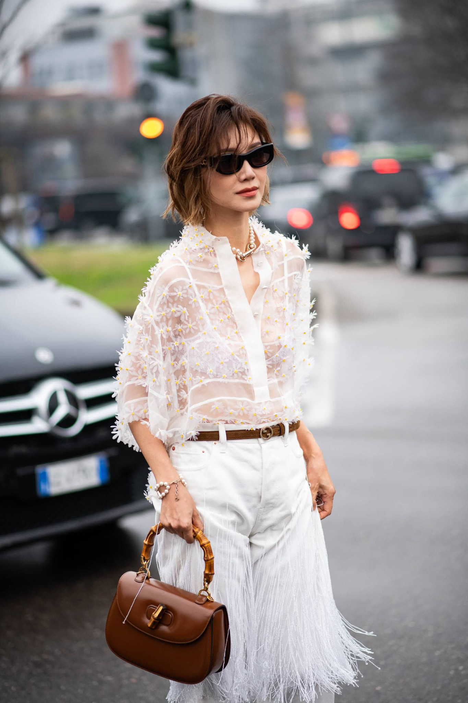

**What makes this shot work:**

| Element | Analysis |
|---------|----------|
| **Eye Line** | Looking slightly past the camera to the left — aware of the photographer but not performing. Neutral expression with composed energy. |
| **Framing** | Waist-up crop showing the full blouse construction, the belt, the bamboo bag held in one hand. The fringe of the pants is just visible at the bottom edge. |
| **City ID** | A black Mercedes with the three-pointed star badge clearly visible behind her right shoulder. This is Milan's equivalent of NYC's yellow cab or London's red bus — luxury European cars (Mercedes, BMW, Maserati) parked on the street are an instant Milan/Italian city identifier. |
| **Garment Detail** | The blouse's grid-like embroidery pattern is visible — horizontal and vertical seam lines create a lattice with daisies placed at intersections. The belt's round gold buckle creates a focal point at the waist transition. |
| **Light** | Overcast Milan winter light — soft, even, no harsh shadows. The white outfit glows without blowing out. |

**Key lesson**: **Luxury European vehicles are Milan's city-ID objects.** NYC has yellow cabs, London has red buses, Paris has striped bollards — Milan has luxury cars. A Mercedes badge, a Maserati grille, or a BMW logo in the background instantly says "Milan" without needing architecture. Place them in the mid-ground behind the subject, slightly out of focus but recognizable.

---

### Angle 3 (Through-the-Crowd): Shooting Between Foreground Figures
**File**: `references/milan_case8_through_crowd.png`

**What makes this shot work:**

| Element | Analysis |
|---------|----------|
| **Eye Line** | Looking directly forward, past the camera — neutral, composed, not engaging the photographer. The sunglasses eliminate any eye-contact ambiguity. |
| **The Crowd Framing** | A large BLURRED FIGURE — dark coat, shoulder and arm — fills the LEFT third of the frame in the foreground. People in dark clothing are visible on the RIGHT edge and in the background. The model is framed BETWEEN these foreground figures, as if the photographer was shooting THROUGH the crowd. |
| **Depth** | This is the deepest layered shot in the entire collection. Foreground figure (large, dark, blurred) → subject (sharp, white outfit) → mid-ground figures (partially visible) → background (grey urban Milan). The contrast between the dark foreground and white subject creates maximum visual separation. |
| **The Technique** | This is NOT the standard "passerby in the background." The crowd is in the FOREGROUND and on the SIDES — the photographer crouched or positioned themselves within the crowd and shot through gaps between people. The result: the model appears discovered, found within the fashion week crowd, not isolated from it. |
| **City Signal** | The pole/post on the right, the overcast light, and the crowd density all read as a Milan show venue exterior. |

**Key lesson**: **"Through-the-crowd" framing is the most powerful authenticity technique.** Instead of placing blurred figures behind the subject, place them IN FRONT — large, dark, out of focus, occupying the frame edges. The photographer was physically inside the crowd, shooting through gaps. This technique works best in Milan because the crowd is impeccably dressed — dark tailored coats and structured outfits create sophisticated, non-distracting foreground mass. The dark foreground also provides tonal contrast for light-colored outfits.

---

### Angle 4 (Full Body): Crosswalk Documentation
**File**: `references/milan_case8_full_body.png`

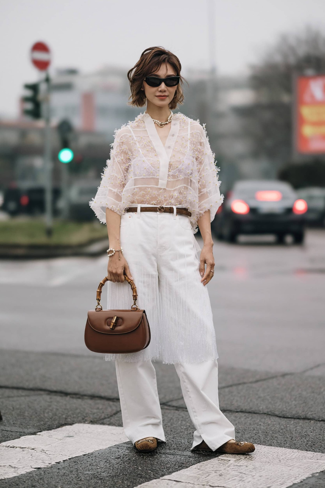

**What makes this shot work:**

| Element | Analysis |
|---------|----------|
| **Eye Line** | Looking into the middle distance, past the camera. Neutral, contemplative. Not performing. |
| **Full Outfit** | Every element documented: sheer blouse with daisies (tucked in), cognac belt with gold buckle, white fringe pants (fringe hangs to mid-calf), cognac suede loafers, bamboo-handle bag in left hand, sunglasses, pearl necklace. Collar to shoes, sharp. |
| **Fringe Detail** | The white fringe on the pants reads clearly at full-body distance — the individual strands are visible, creating a textural layer over the wide-leg silhouette. This is where the "movement story" lives even in a static shot — the fringe suggests motion even when standing still. |
| **Setting** | Milan crosswalk — zebra stripe markings on the asphalt, traffic light and signal pole visible, cars and buildings in the background. The crosswalk is a transitional space that reads as "between shows." |
| **Pose** | Weight on one foot, slight head tilt, bag held naturally at the side. The "paused between steps" stance — not posed, but momentarily still on a crosswalk. |

**Key lesson**: **Fringe and feathered garments suggest movement even in a static full-body shot.** The individual strands hang with gravity, creating visual texture that reads as kinetic potential. In the approach shot, fringe catches the stride and trails; in the full-body, it hangs and reveals the garment's construction underneath. Document fringe garments in both states — motion (approach) and stillness (full body) — to show the full behavior range.

---

## Case 9: Milan — GG Monogram Blazer + Fair Isle Layering

A Milan Fashion Week F25 set. This model wears a cognac/tan Gucci GG-monogram suede blazer with notch lapels, a brown Fair Isle patterned cardigan/vest with button front (geometric + stripe motifs in brown, teal, red, cream), a cream/white collared dress shirt with long cuffs extending past blazer sleeves, dark indigo wide-leg jeans, a Gucci GG-monogram newsboy/flat cap in cream-and-grey, gold hoop earrings, wire-rim clear glasses, dark brown leather shoulder bag, silver rings. Asian woman with dark hair pulled back.

**What Case 9 adds that Cases 1–8 didn't:**

### Angle 1 (Profile Detail): Hat as Silhouette Modifier
**File**: `references/milan_case9_profile_cap.png`

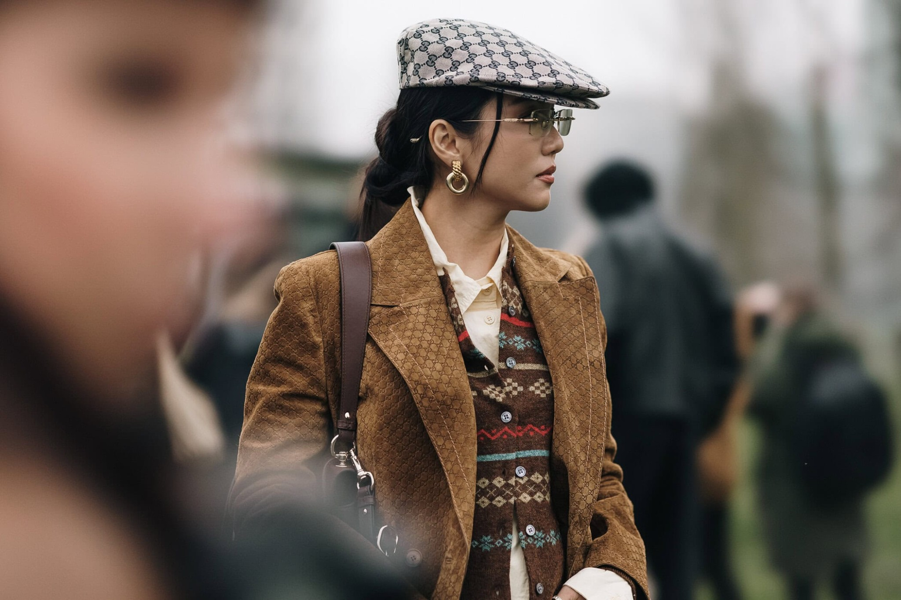

**What makes this shot work:**

| Element | Analysis |
|---------|----------|
| **Eye Line** | Near-profile — looking to the RIGHT, roughly 70° from the lens. Caught mid-walk or mid-thought. The clear glasses don't shield the eyes the way sunglasses do, but the profile angle compensates. |
| **The Cap** | The GG-monogram newsboy cap completely changes the HEAD SILHOUETTE. Without it, this would be a standard layered-blazer shot. With it, the head becomes a distinctive shape that's instantly recognizable across all frames — aiding model consistency. The cap's pattern (GG monogram) echoes the blazer's monogram, creating visual rhyme between head and shoulders. |
| **Layering Junction** | The neckline V-zone shows all three layers: blazer lapel → Fair Isle cardigan buttons → white shirt collar. This stacking is the outfit's story — the close crop makes it legible. |
| **Crowd Framing** | Blurred figures in BOTH foreground (dark coat on the left) and background (people in the crowd). The model is found within the fashion week crowd, not isolated from it — similar to Case 8's through-the-crowd technique but at a tighter crop. |
| **Accessories** | Gold hoop earrings catch the light. The clear glasses add intellectual energy. The bag strap crosses the shoulder. |

**Key lesson**: **A hat or cap is a silhouette modifier that aids consistency.** The newsboy cap creates a distinctive head shape that's immediately recognizable across all frames — in the approach (seen from distance), the full body (documented head-to-toe), the detail (at close range). This helps face-lock because the AI can anchor on the hat+face combination. Additionally, when the hat's pattern matches the garment (GG monogram on both), it creates a visual rhythm across the outfit.

---

### Angle 2 (Walking Approach): Suburban Milan Street
**File**: `references/milan_case9_approach.png`

**What makes this shot work:**

| Element | Analysis |
|---------|----------|
| **Eye Line** | Looking slightly DOWN and to the left — natural walking gaze. Not aware of the camera. The cap brim partially shields the eyes. |
| **Full Outfit in Motion** | Mid-stride walking toward camera. The blazer's suede texture catches the overcast light. Wide-leg jeans pool at the shoes. The Fair Isle cardigan peeks out at the V-opening of the blazer. The white shirt cuffs extend past the blazer sleeves — a deliberate styling detail visible in motion. |
| **Setting** | This is NOT Via Monte Napoleone or the luxury district. It's a wider, more suburban Milan street — a bus stop with blue signage is visible in the background, apartment buildings, a broader sidewalk. This expands Milan's shooting vocabulary beyond the Quadrilatero della Moda default. |
| **The Cap in Motion** | The newsboy cap is instantly recognizable even at full-body distance, confirming this is the same person from the detail shot. It anchors the head silhouette. |
| **Light** | Overcast Milan winter — soft, even, the suede texture reads well without harsh shadows. |

**Key lesson**: **Milan is not just the luxury district.** The area around show venues extends into wider boulevards, residential neighborhoods, and bus-stop territory. These suburban Milan streets have their own visual identity — broader, greyer, less ornate than palazzo-lined shopping streets but still unmistakably Milanese. They provide cleaner, less competitive backgrounds for complex outfits with multiple layers and patterns.

---

### Angle 3 (Candid Moment): Hands-in-Pockets Natural Pose
**File**: `references/milan_case9_candid_moment.png`

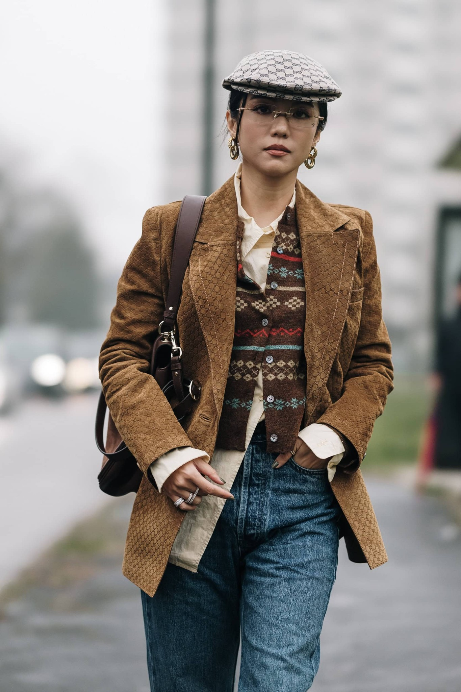

**What makes this shot work:**

| Element | Analysis |
|---------|----------|
| **Eye Line** | Looking slightly past the camera to the left — neutral, composed. The clear glasses reflect ambient light. Aware of the photographer but not engaging. |
| **Hands-in-Pockets** | Both hands are near the waist/pockets — one thumb hooked in the jeans pocket, the other resting at the hip. This is the most natural resting pose possible. It reads as genuinely unstaged because nobody puts their hands in their pockets for a camera — they do it because they're waiting, standing, being themselves. |
| **Layering Legibility** | The waist-up crop shows the three-layer junction at maximum clarity: the blazer's notch lapel and suede monogram texture, the Fair Isle cardigan's button front with geometric patterns, and the white shirt collar and cuffs. The bag strap crosses the shoulder, adding a fourth visual line. |
| **Cap Detail** | At this closer crop, the GG monogram on the cap is legible — matching the monogram on the blazer. This monogram repetition across two garment pieces creates a brand-identification signal that fashion week attendees instantly read. |
| **Background** | Soft urban Milan bokeh — a road, distant buildings, blurred vehicles. Quiet, unintrusive, lets the layered outfit do all the visual work. |

**Key lesson**: **Hands-in-pockets is the most authentic candid pose for layered outfits.** It keeps the arms close to the body, which opens the V-zone where all layers meet. The viewer can see every layer stacking from blazer to shirt simultaneously. It also reads as genuinely unstaged — unlike crossed arms (defensive) or hands at sides (awkward), hands-in-pockets says "this person is just standing here, being themselves." Use it for any outfit with three or more visible layers.

---

### Angle 4 (Full Body): Three-Layer Documentation
**File**: `references/milan_case9_full_body.png`

**What makes this shot work:**

| Element | Analysis |
|---------|----------|
| **Eye Line** | Looking past the camera to the right — middle distance, neutral. The cap brim creates a shadow line across the forehead that adds structure to the face. |
| **Full Outfit** | Everything documented: GG-monogram cap, clear glasses, gold hoops, suede monogram blazer, Fair Isle cardigan, white shirt with extended cuffs, dark indigo wide-leg jeans, dark shoes. Collar to shoes, sharp. The layering reads from the top down in clear strata. |
| **Proportions** | The oversized blazer + wide-leg jeans create a relaxed, contemporary Italian silhouette — not the sharp tailoring of classic Pitti but the new generation's studied casualness. The proportions tell a story about modern Milan menswear-influenced womenswear. |
| **Setting** | Wider Milan street — apartment buildings and a teal/blue bus visible in the far background. Cracked asphalt pavement. Overcast sky. The suburban Milan setting matches the outfit's relaxed energy. |
| **Stance** | Weight shifted, one hand near pocket, slight head tilt. The "paused at a bus stop" energy — completely natural, completely unstaged. |

**Key lesson**: **Logo/monogram repeat across multiple pieces creates visual rhythm in the full-body shot.** The GG monogram appears on the cap AND the blazer — at full-body distance, this creates a pattern echo between head and body that unifies the outfit visually. When documenting logo-heavy outfits, the full-body shot should frame head and body together at a distance where the pattern repeat is readable. The viewer's eye bounces between the two monogram surfaces.

---

## Case 10: Milan — Navy Geometric Co-ord Set

A Milan Fashion Week S26 set shot in STRONG DIRECTIONAL SUN. This model wears a navy/dark blue geometric tile-print matching co-ord set — a bandeau/strapless crop top and a high-waisted belted A-line midi skirt. Accessories: thin gold chain necklace, gold chain bracelet, round tortoiseshell sunglasses, navy structured mini bag with geometric clasp, black pointed-toe slingback kitten heels. Blonde woman with long soft waves past shoulders, Western European.

**What Case 10 adds that Cases 1–9 didn't:**

### Angle 1 (Walking Approach): Photographer in Background
**File**: `references/milan_case10_approach.png`

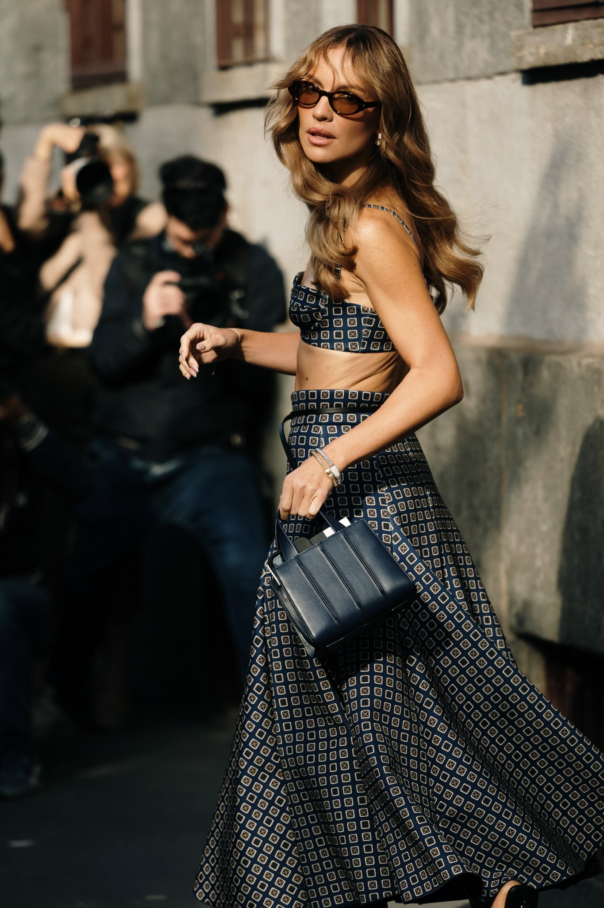

**What makes this shot work:**

| Element | Analysis |
|---------|----------|
| **Eye Line** | Three-quarter view, looking to the RIGHT — past the camera, glancing at something off-frame. The sunglasses handle the eye-contact problem. Hair flowing from the stride. |
| **Hard Mediterranean Sun** | Strong directional sunlight from the LEFT creates warm golden skin tones and defined shadows. This is fundamentally different from the overcast light in London (Cases 4-5) and Paris (Cases 6-7). Milan's S/S season delivers this intense, directional Mediterranean light. The skin GLOWS — warm, bronze, dimensional. |
| **Co-ord in Motion** | The A-line skirt swings from the stride, creating volume and movement. The crop top stays in place (structured bandeau). The EXPOSED MIDRIFF between top and skirt is the visual signature of a co-ord set — it creates a horizontal line of skin that breaks the outfit into two connected halves. |
| **Photographer Behind** | A photographer with camera raised is visible in the background on the LEFT — slightly blurred, shooting something else. This is the strongest "fashion week" signal: other photographers are working. Combined with a stone building wall and blurred crowd, the scene reads as venue-adjacent. |
| **Bag Position** | The navy bag hangs from the right hand, its structured shape catching light — it echoes the geometric print of the outfit. |

**Key lesson**: **Hard directional Mediterranean sun is Milan's signature light quality for S/S seasons.** It creates warm skin tones, defined shadows, and a golden atmosphere that doesn't exist in overcast London or silvery Paris. When shooting Milan S/S, describe this light explicitly in `--lighting`: "strong directional Mediterranean sun from the left, warm golden skin tones, defined shadow on right side of face." This light also makes geometric prints more legible — the contrast between navy and white intensifies in direct sun.

---

### Angle 2 (Close Detail): Co-ord Pattern at Maximum Legibility
**File**: `references/milan_case10_close_detail.png`

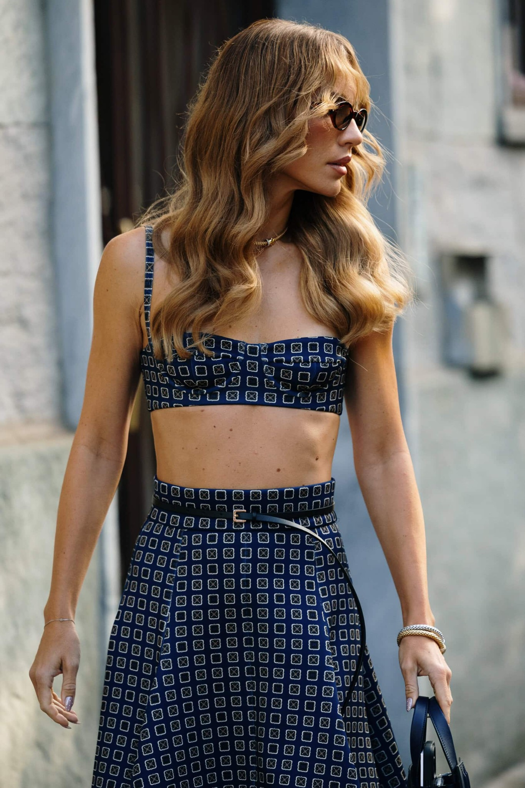

**What makes this shot work:**

| Element | Analysis |
|---------|----------|
| **Eye Line** | Three-quarter view looking RIGHT — past the camera. The tortoiseshell sunglasses push up into the wavy hair. Relaxed, confident. |
| **Pattern Legibility** | At this crop (chest to face), the geometric tile print is rendered at full resolution — you can see individual squares, the navy-and-cream color contrast, the print scale relative to the body. The bandeau's construction (structured, strapless, geometric) is fully documented. |
| **Warm Light on Skin** | The strong sun illuminates the décolletage and shoulders — the skin is warm bronze. The light plays differently on skin (warm, glowing) vs. the matte navy fabric (absorbing, deep) vs. the gold jewelry (reflective, bright). Three material responses to the same light. |
| **Accessories** | The gold chain necklace sits at the collarbone, the bracelet catches light on the wrist. The sunglasses are pushed up, functioning as a hair accessory rather than eye wear. These details humanize the outfit — she's between shows, sunglasses up, relaxed. |
| **Background** | Warm-toned stone building, soft focus. A grey marble or stone wall texture that's unmistakably Italian — not London brick or Paris cream limestone. |

**Key lesson**: **Co-ord sets demand a detail shot that shows the PATTERN CONTINUITY between the two pieces.** The crop top and skirt share the same print — the detail shot must prove they're a set, not random separates. Frame the crop at a distance where the pattern on the top and the pattern on the skirt are BOTH visible, showing that the geometric repeat matches across the gap. The exposed skin at the midriff becomes the visual break between two surfaces of the same pattern.

---

### Angle 3 (Full Body): Narrow Stone Side Street
**File**: `references/milan_case10_full_body.png`

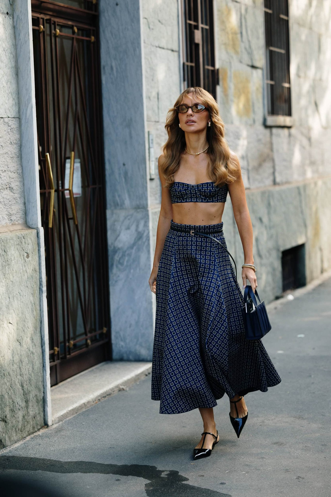

**What makes this shot work:**

| Element | Analysis |
|---------|----------|
| **Eye Line** | Looking LEFT — past the camera, walking with purpose. Hair swept by the stride. Not engaged with the photographer. |
| **Full Outfit** | Every element documented: strapless bandeau crop top, exposed midriff, belted high-waisted A-line midi skirt, navy bag in hand, black slingback heels, sunglasses, necklace, bracelet. The skirt's full volume is visible — it flares from the waist and catches air during the stride. |
| **Fabric Translucency** | In the strong backlight/sidelight, the skirt fabric becomes slightly TRANSLUCENT at the edges — you can see the faintest outline of legs through the fabric where light passes through. This is a quality unique to strong Mediterranean sun: lightweight fabrics reveal their sheer quality when backlit. It adds dimensionality — the fabric is alive, not opaque and flat. |
| **Narrow Street** | The model walks down a NARROW Milanese side street — old stone facades on the left with heavy wooden doors and iron window grilles, grey marble walls. This is the intimate, aged Milan that tourists don't see. The narrow street creates natural framing — the buildings funnel the eye toward the subject. |
| **Scale** | The narrow street + full-body framing creates a sense of the outfit occupying its environment. The skirt's volume fills the visual space between the stone walls. |

**Key lesson**: **Fabric translucency in strong backlight is a Milan S/S gift.** When lightweight fabrics (cotton, linen, silk) are backlit or sidelit by strong Mediterranean sun, they become partially translucent at the edges. This reveals the garment's sheer quality and adds dimensional interest that flat overcast light can never produce. When shooting Milan S/S, position the model so the sun comes from behind or to the side — describe "backlit fabric edges showing slight translucency" in `--lighting`. This is a quality unique to Mediterranean sun cities.

---

### Angle 4 (Walking Approach Variant): Skirt Volume in Motion
**File**: `references/milan_case10_walking_approach.png`

**What makes this shot work:**

| Element | Analysis |
|---------|----------|
| **Eye Line** | Looking forward past the camera — walking with composed purpose. Sunglasses handle the eye problem. The hair falls naturally, catching the warm light. |
| **Skirt Swing** | The A-line midi skirt is in FULL SWING from the stride — the fabric billows out, the hem catches air, creating maximum volume. This is the movement shot for a voluminous skirt: the stride at its widest point, fabric fully extended. The geometric print distorts slightly in the drape, adding visual interest. |
| **Matched Geometry** | At full-body walking distance, the matching print across crop top and skirt creates a visual unity DESPITE the midriff gap. The viewer's eye connects the two pieces through the shared pattern. This is the co-ord's superpower — it reads as one outfit even with exposed skin between. |
| **The Bag** | The structured navy bag hangs from the right hand, swinging slightly from the stride. Its geometric clasp echoes the print — a detail-level coordination that's visible at full-body distance in strong light. |
| **Background** | Narrow stone Milan side street continues — warm stone, iron grilles, wooden doors. Strong directional sun creates a warm golden atmosphere. A cyclist or pedestrian is barely visible in the far background. |

**Key lesson**: **Co-ord sets need at least one motion shot.** The approach shot reveals how the matching pieces RELATE in motion — the crop top stays anchored while the skirt swings, the gap between them shifts as the body moves, the pattern alignment breaks and reforms with each stride. Static shots document the co-ord; motion shots show how it LIVES. For A-line or full skirts, capture the stride at maximum extension when the fabric volume peaks.

---

## Case 11: Milan — Denim Jacket + Shorts + Knee Boots

A Milan Fashion Week S26 set shot in LATE AFTERNOON GOLDEN LIGHT. This model wears a dark raw denim jacket with white/cream contrast buttons and chest pockets, a white crew-neck T-shirt, black hot-pants/micro shorts, black knee-high riding-style boots with harness detail, cream/white crew socks visible between shorts and boots. Accessories: dark quilted leather shoulder bag with gold chain hardware (woven chain strap), phone in hand. Asian woman with short black bob and bangs.

**What Case 11 adds that Cases 1–10 didn't:**

### Angle 1 (Shadow Wall): Model's Own Shadow as Composition
**File**: `references/milan_case11_shadow_wall.png`

**What makes this shot work:**

| Element | Analysis |
|---------|----------|
| **Eye Line** | Hand raised to SHIELD EYES from the sun — she's squinting into the late afternoon light, genuinely reacting to the brightness. The hand-on-forehead gesture is natural, unstaged, and physically motivated by the real conditions. |
| **THE SHADOW** | The model's own SHADOW is cast on the warm beige wall behind her. The shadow reveals her silhouette from a completely different angle — arms raised, body standing, legs in boots. This is a DUAL PORTRAIT: the model in 3D + her 2D shadow simultaneously. The shadow adds a compositional layer that no other case study has introduced. |
| **Wall as Canvas** | The plain beige/cream stucco wall serves as both backdrop AND shadow projection surface. It's the simplest possible background — one texture, one color — which makes both the model and her shadow read clearly. The wall has a horizontal concrete ledge at waist height that creates a subtle frame break. |
| **Golden Hour Light** | Late afternoon Milan sun — warm, golden, coming from a low angle that creates the long dramatic shadow. The light is warm on the skin and fabric. The denim jacket's dark indigo absorbs the warmth while the white T-shirt and white socks catch it. |
| **The Boot-Sock Detail** | The white socks visible between the black shorts and black boots create a deliberate visual break — a bright horizontal band that draws the eye to the shoe styling. This is an intentional styling detail. |

**Key lesson**: **The model's own shadow on a plain wall is a completely new compositional element.** In late afternoon/golden hour sun, position the model near a plain-colored wall (beige stucco, cream stone, warm concrete) so their shadow is cast clearly. The shadow creates a second silhouette — you get two compositions in one frame. Describe this in `--street_texture`: "warm beige stucco wall behind model, late afternoon sun casting the model's full shadow on the wall surface." This technique is specific to cities with strong sun (Milan S/S, Florence) and doesn't work in overcast London or silvery Paris.

---

### Angle 2 (Laughing Candid): Playful Energy
**File**: `references/milan_case11_laughing_candid.png`

**What makes this shot work:**

| Element | Analysis |
|---------|----------|
| **Eye Line** | Eyes crinkled shut in GENUINE LAUGHTER — head slightly tilted, mouth open, pure joy. The sun is in her eyes and she's laughing about it. Arms slightly spread — one with phone, the other extended with bag swinging. The shadow is still visible on the wall behind. |
| **Animated Body** | This is the most PHYSICALLY ANIMATED candid in the entire collection. Arms spread, mid-laugh, body loose and open. Compare to Case 7's Paris laughter (which was frontal, mouth open but more controlled) — this is wilder, freer, more spontaneous. The body language says "summer, sun, Milan, joy." |
| **Outfit in Motion** | The denim jacket opens from the arm spread, revealing more of the white T-shirt. The bag swings on its chain strap. Even the short bob haircut moves. The outfit responds to the body's animation — the garment is ALIVE because the wearer is alive. |
| **Shadow Play** | The wall behind still captures her shadow, but now the shadow shows the animated pose — arms spread, bag extended. The shadow is a time-stamped record of this specific moment. |
| **Summer Milan Energy** | This energy is distinctly Milan S/S: warm, golden, playful, sensual. It's different from the composed cool of Paris or the eclectic boldness of London. Milan summer street style can be joyful. |

**Key lesson**: **Playful, animated energy is valid for Milan S/S.** The default street style mood is cool composure — aware of the camera but not performing. But Milan summer, with its golden light and warm atmosphere, can support a more joyful, physically animated candid. The model's genuine laughter and spread arms read as "summer energy" rather than "posing for camera." Match the expression energy to BOTH the outfit energy AND the season: summer outfits (shorts, crop tops, bare skin) can carry summer expressions.

---

### Angle 3 (Close Detail): Raw Denim Texture
**File**: `references/milan_case11_close_detail.png`

**What makes this shot work:**

| Element | Analysis |
|---------|----------|
| **Eye Line** | Looking slightly toward the camera but RELAXED — not performing, not engaged. The short bob with bangs frames the face. The late afternoon light catches the cheekbone and jawline, creating warm modelling on the face. |
| **Denim Texture** | At this crop (shoulder-up), the raw denim jacket's texture is fully legible — the indigo weave, the dark weft, the contrast white buttons, the chest pocket construction, the collar fold. Raw denim has a specific visual quality: stiff, dark, un-faded, with visible selvedge character. This is a MATERIAL STORY that the detail shot must tell. |
| **Warm Light on Skin** | The golden hour light illuminates the face with warm, directional modelling — shadow under the chin, warm glow on the cheek, the hair catches amber highlights. This is cinematic-quality natural light, available for free on a Milan summer street at 6pm. |
| **Background** | A dark vehicle (SUV or van) fills the background — creating a dark backdrop that makes the model's face and the light-catching denim pop through contrast. |
| **Bag Detail** | The quilted bag with gold chain hardware is visible at the shoulder — the chain's woven pattern adds a textural counterpoint to the denim's woven pattern. Two different weaves in one crop. |

**Key lesson**: **Raw/unwashed denim has a specific texture story.** Unlike washed denim (soft, faded, broken-in), raw denim is stiff, dark, and has visible weave character. The detail shot should render this at close range — the difference between "denim jacket" and "raw selvedge denim jacket" is only visible at detail-crop distance. Pair denim texture shots with warm directional light that catches the weave's ridges and creates micro-shadows in the fabric.

---

### Angle 4 (Lamppost Lean): Pole as Vertical Anchor
**File**: `references/milan_case11_lamppost_lean.png`

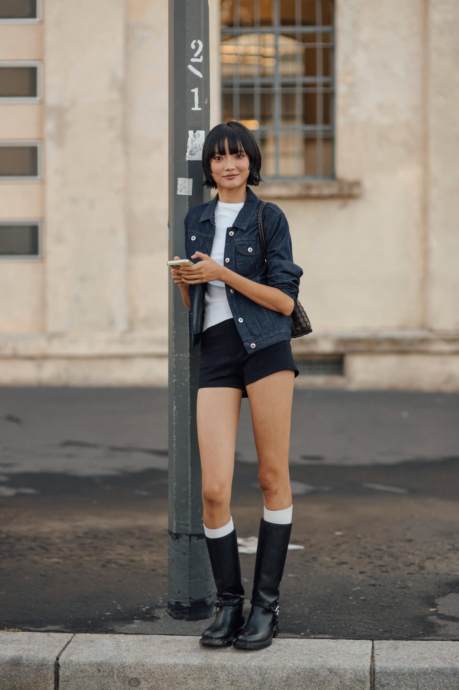

**What makes this shot work:**

| Element | Analysis |
|---------|----------|
| **Eye Line** | Looking DOWN at the phone in her hands — completely absorbed, not aware of the camera. The bangs partially cover the downcast eyes. |
| **The Lamppost** | The model leans casually against a dark metal LAMPPOST/street pole (marked "2/1"). The pole runs vertically through the frame, creating a strong compositional line that the model uses as a leaning surface. Her body makes contact with the pole at the shoulder/arm, creating a natural, relaxed lean. This is a prop that exists on every street in every city. |
| **Full Outfit** | Despite the lean, the full outfit is documented: denim jacket, white tee, black shorts, white socks, black knee-high boots with harness buckle. The phone in her hands and the bag on her shoulder complete the picture. The lean opens the jacket slightly, showing the T-shirt underneath. |
| **Setting** | Stone/marble building facade behind her — a heavy wooden door with iron hardware, a barred window. This is old residential Milan — not luxury shopping, not a venue, just a real city street where someone paused and leaned against a pole. |
| **The Lean** | Leaning against a vertical object is the most natural "waiting" pose. It says: "I'm between shows, I stopped to check my phone, I'm using this pole for support." It's more relaxed than standing, more natural than sitting, and it opens the body to show the outfit. |

**Key lesson**: **Lampposts, poles, and vertical street furniture are available leaning props in every city.** The model leaning against a pole while checking their phone produces the most naturally relaxed full-body shot possible — it's a pose people actually adopt on the street. The pole provides a vertical compositional line that anchors the frame and gives the viewer's eye a path from top to bottom. Use when the outfit is simple enough that a relaxed lean won't obscure key details.

---

### Supplementary Insights from Milan F25/S26 Sets

Two additional Milan sets contribute techniques that don't require full case treatment but expand your vocabulary:

**From Milan Beige Jacquard** (beige paisley jacquard shirt dress, rope belt with fringe tassels, long beige overcoat, black slingback kitten heels, tortoiseshell oversized glasses, pearl necklace, bracelets):
- **Photographer pack in the background**: Not just one blurred photographer but a CROWD of photographers and onlookers — three or four visible simultaneously, some with cameras raised, some watching. This reads as an arrival moment at a major show. The density of the photographer pack scales with the show's importance. Milan's major venue arrivals (Armani, Prada, Gucci) produce the densest packs.
- **Overcoat movement in stride**: The long overcoat flares open during a crosswalk stride — the flare reveals the shirt dress underneath and the leg line. Overcoats in motion create dramatic volume changes frame-to-frame, making the approach shot particularly powerful for outcoat looks.
- **Tonal beige-on-beige dressing**: When the coat and dress are the SAME color family, the photographer must find contrast elsewhere — here, the black slingbacks and dark tortoiseshell glasses provide anchor points. The rope belt fringe tassels add textural contrast within the same hue. In the detail shot, focus on texture differences (smooth coat vs. jacquard weave vs. rope) rather than color differences.
- **Rope belt as fringe detail**: The white rope belt with fringe tassels is a specific textile element that needs close-up documentation — the rope braiding, the tassel construction, the bamboo-tip hardware. When a styling detail is this specific, add an extra detail crop that frames it.

**From Milan Camel Oversized Jacket** (camel/sand oversized wool zip jacket with flap pockets, dark indigo bootcut jeans, small black leather chain-link clutch, oversized gold-frame aviator sunglasses, gold small hoop earrings — Black woman with close-cropped hair):
- **Oversized-vs-slim proportion contrast as silhouette story**: The dramatically oversized jacket against slim bootcut jeans creates a proportion play that IS the outfit's story. The full-body shot should frame at a distance where the size differential is clear — the jacket's volume above the waist vs. the jeans' slim line below. This is a two-piece outfit where SHAPE, not detail, is the subject.
- **Genuine wide smile (confirmed for Milan)**: Like Paris Case 7, Milan can support genuine, full smiles — especially in the warmer S/S season. The model's broad, open smile reads as confidence and joy, not as "posing for camera," particularly when combined with sunglasses that break the direct-eye-contact risk.
- **Looking-down-at-feet/shoes moment**: The model looks DOWN at her boots — head bent, chin toward chest. This is a natural variant of the "checking their step" eye direction: she's examining her footwear (or adjusting her footing on uneven pavement). It creates a contemplative, private moment and shows the model from a rarely-seen top-down angle perspective.
- **Minimal outfit where shape IS the story**: With only two pieces (jacket + jeans), there are no layers, no pattern, no embellishment to document. The Detail shot should focus on MATERIAL: the wool's weight, the zip construction, the flap pocket engineering. The Full Body shot should maximize the proportion contrast at a distance where the oversized shape reads clearly.

> **Note**: The instincts derived from these photos (eye line, crowd, sequence, imperfection) are codified in [SKILL.md](SKILL.md) under "How You Shoot." This file is the visual evidence — SKILL.md is how you work.
